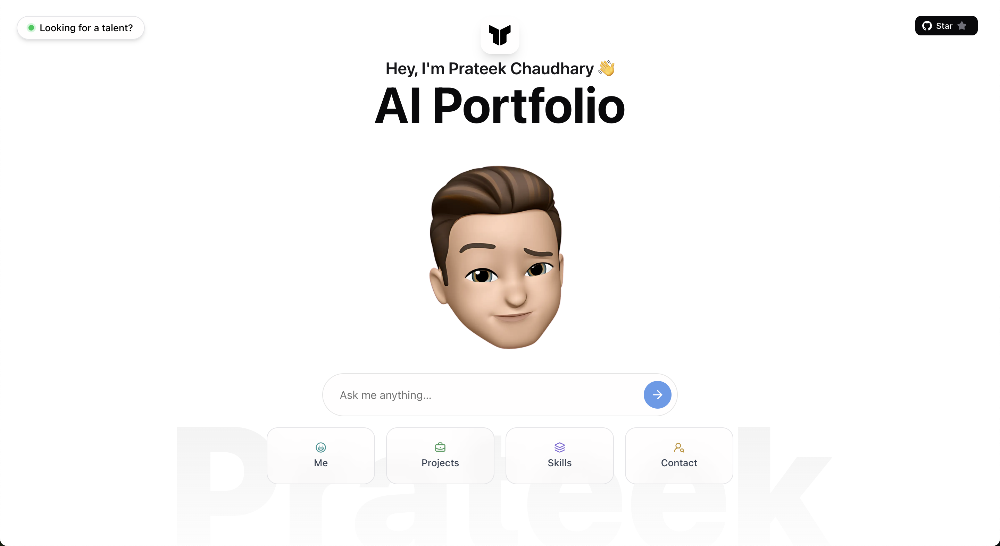

 
# World's first AI portfolio 🤖✨  

**Static portfolios are dead.**  
So I built Prateek AI Portfolio.

Instead of making you scroll endlessly, my portfolio adapts to *you*.  
Ask a question — my AI avatar replies instantly.

## 👇 What can you ask?

- 🧠 **Tech recruiter?** Ask about my stack & results  
- 💻 **Dev?** Dive into my code & mindset  
- 🧑‍🤝‍🧑 **Friend or family?** See what I’ve been working on  

---

This is not a portfolio.  
It’s a **conversation tailored to your curiosity**.

*What will you ask?*

## 🚀 How to run

Want to run this project locally? Here's what you need:

### Prerequisites
- **Node.js** (v18 or higher)
- **pnpm** package manager
- **OpenAI API token** (for AI chat functionality)
- **GitHub token** (for GitHub integration features)

### Setup
1. **Clone the repository**
   ```bash
   git clone <your-repo-url>
   cd portfolio
   ```

2. **Install dependencies**
   ```bash
   pnpm install
   ```

3. **Environment variables**
   Create a `.env` file in the root directory:
   ```env
   OPENAI_API_KEY=your_openai_api_key_here
   GITHUB_TOKEN=your_github_token_here
   ```

4. **Run the development server**
   ```bash
   pnpm dev
   ```

5. **Open your browser**
   Navigate to `http://localhost:3000`

### Getting your **tokens**
- **OpenAI API Key**: Get it from [platform.openai.com](https://platform.openai.com/api-keys)
- **GitHub Token**: Generate one at [github.com/settings/tokens](https://github.com/settings/personal-access-tokens) with repo access

## 🏗️ Standalone Deployment

This project is configured for standalone deployment with optimized production builds.

### Build for Production
```bash
# Build the standalone application
pnpm run build

# Run the standalone server
pnpm run start:standalone
```

### Docker Deployment
```bash
# Build Docker image
docker build -t prateek-portfolio .

# Run Docker container
docker run -p 3000:3000 -e NODE_ENV=production prateek-portfolio
```

### Azure App Service Deployment
The project includes:
- **web.config** for IIS integration
- **ecosystem.config.js** for PM2 process management
- **startup.sh** for Azure App Service startup
- **GitHub Actions workflow** for automated deployment

### Files for Deployment
- `server.js` - Custom Node.js server for standalone mode
- `Dockerfile` - Container configuration
- `web.config` - Azure App Service configuration
- `ecosystem.config.js` - PM2 configuration
- `startup.sh` - Azure startup script


#### 🔖 Tags

`#AIPortfolio` `#InnovationInTech` `#DigitalResume` `#JobSearch` `#TechInnovation` `#WebDevelopment` `#FutureTech`
